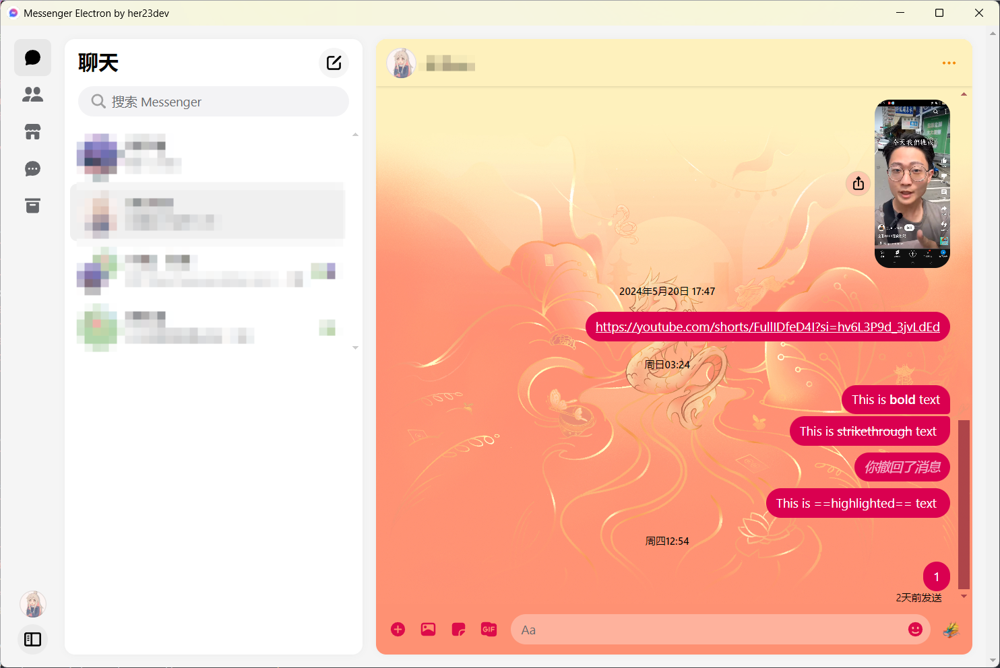
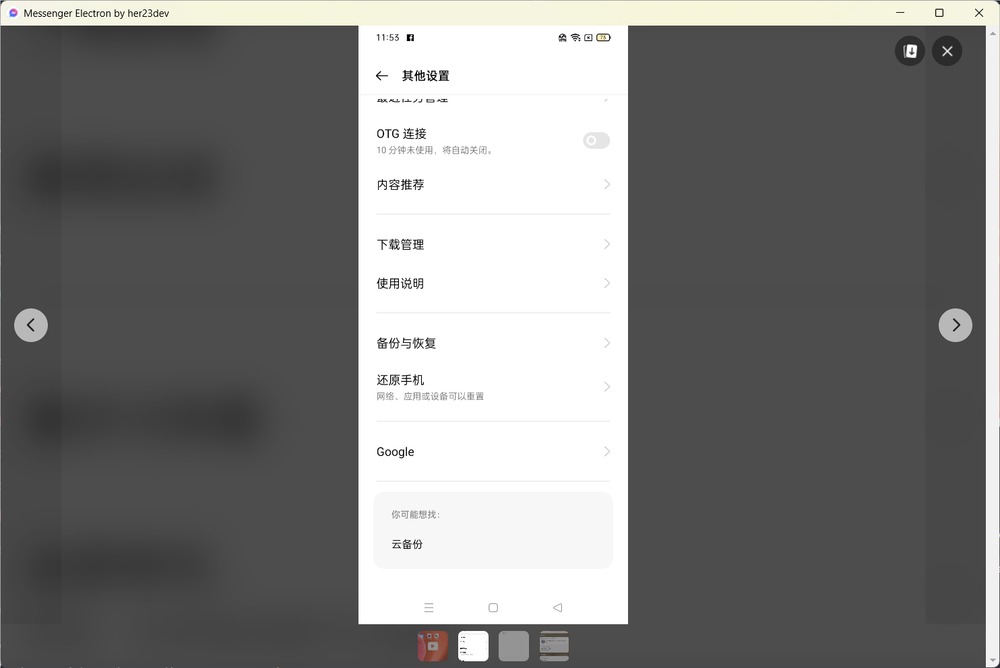

<h1 align="center">Messenger_Electron</h1>

<div align="center">

_Using Messenger on your computer within Electron_

</div>

---

## Introduce

一个基于`Messenger 网页版`和`Electron`所制作的Messenger APP

目前可以实现Messenger网页版所有功能

## Why

因为我的老爷机不知为何, 安装上了Messenger的官方APP后无法打开, 只能通过网页版进行访问.

但是通过网页版访问时, 容易不小心关闭浏览器. 不够方便

于是 `Messenger_Electron` 因此诞生

## Instructions

界面内

| 按键 | 功能 |
| --- | --- |
| F5 | 重载界面 |
| F7 | 完全退出APP |
| F12 | 打开DevTools |

关闭界面后, `Messenger_Electron`将会留存在托盘, 此时右键可以选择显示窗口或完全退出APP

## Screenshots





## Development

#### 注意

本仓库默认使用`electron-builder`进行Windows端的编译

如您有其他平台的编译需求, 请自行调整`package.json`

#### 克隆本仓库

``` git clone --depth=1 https://github.com/zhou-hack/Messenger_Electron ``` 

``` git clone --depth=1 https://gitee.com/zhou-hack/Messenger_Electron ```

#### 安装依赖

``` npm install ```

#### 运行
``` npm start ```

#### 编译

*Windows*

``` npm run build ```


